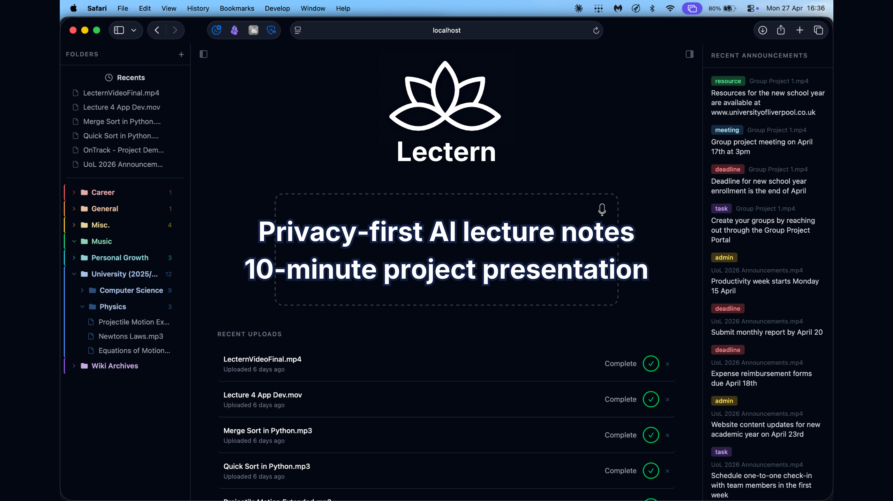
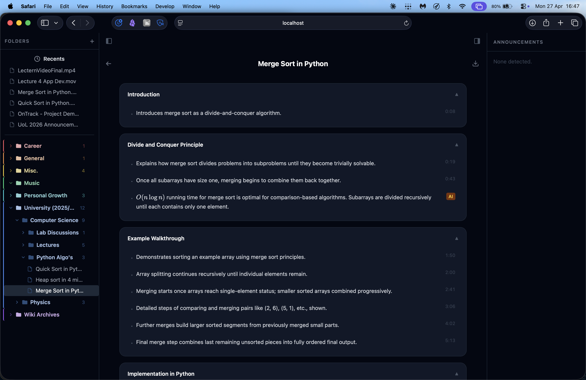
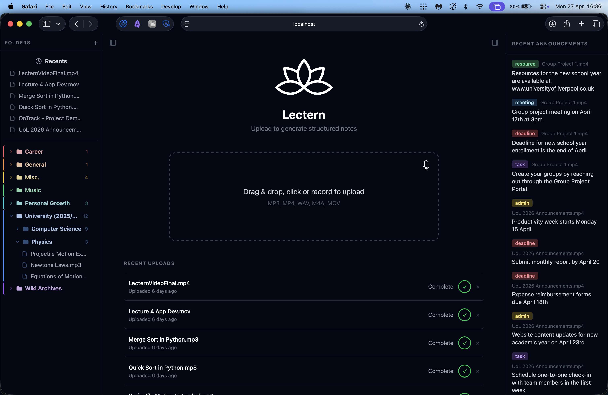
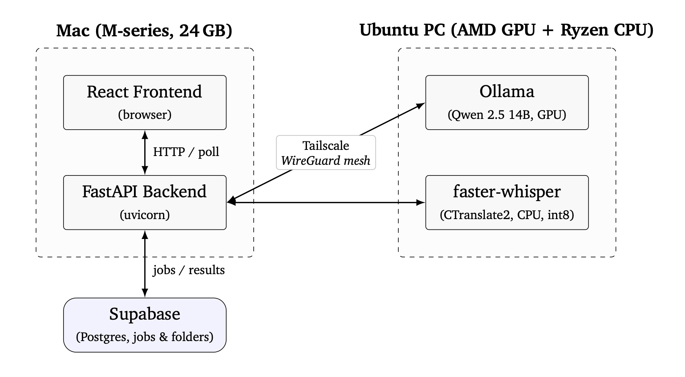
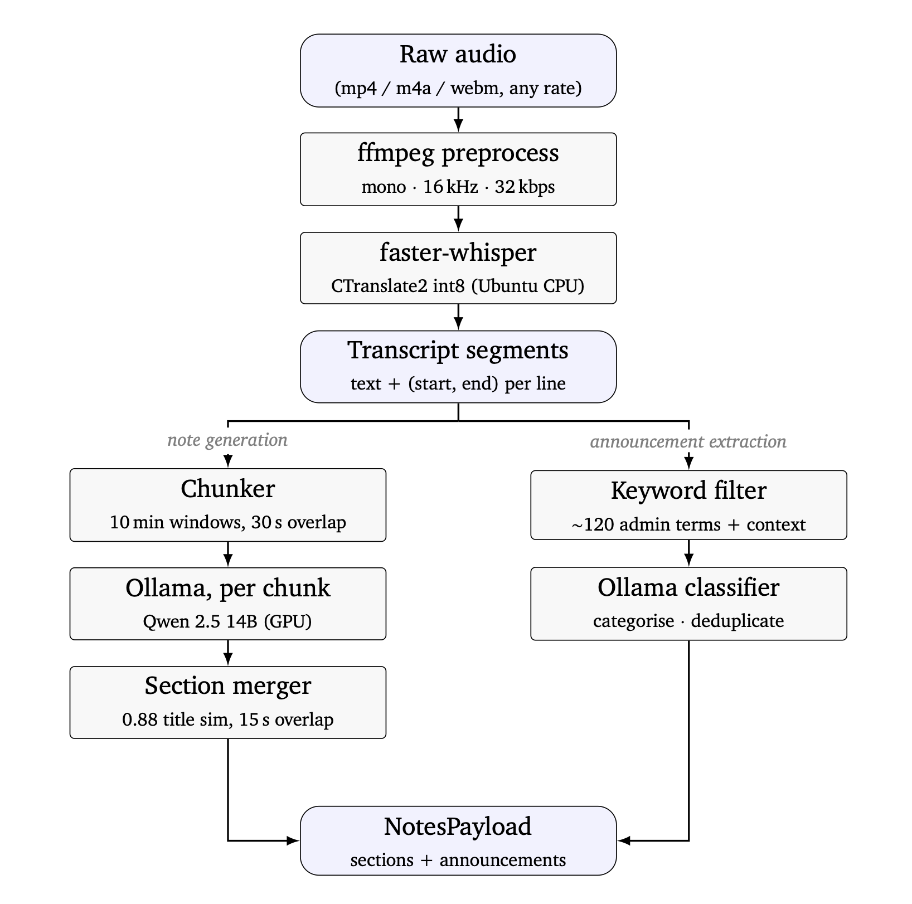

# Lectern

A privacy-first AI lecture note generator that converts lecture audio into structured, timestamped and provenance-aware notes using locally hosted speech recognition and language models.

## Project presentation

[](https://youtu.be/GiA7C5voSe8?si=9bEguRIoOvNTNB6i)

**[Watch the full 10-minute project presentation →](https://youtu.be/GiA7C5voSe8?si=9bEguRIoOvNTNB6i)**

## Overview

Lecture recordings are difficult to search, skim and use efficiently for revision. A raw transcript improves accessibility but still presents students with a long block of unstructured material.

Lectern transforms uploaded or recorded lecture audio into organised revision notes featuring:

- Topic-based sections and summaries
- Timestamped transcript-derived bullet points
- Clearly labelled AI-added content
- Typed logistical announcements
- Rendered mathematical notation and syntax-highlighted code
- Markdown and PDF export
- Hierarchical folder organisation

The speech-recognition and language-model stages run on user-controlled hardware rather than commercial inference APIs.

## Provenance and trust

Large language models can introduce plausible information that was not present in the source recording.

Lectern addresses this by assigning every note bullet one of two explicit provenance values:

- `transcript`: supported directly by the source transcript and linked to a timestamp
- `unverified_llm`: added by the language model as clarification or additional context

This distinction is enforced throughout the application:

1. Prompt rules
2. JSON Schema
3. Pydantic models
4. Supabase JSONB storage
5. FastAPI responses
6. TypeScript types
7. User-interface badges

Provenance is therefore part of the application's data contract rather than a cosmetic frontend label.

## Screenshots

### Structured notes interface



Transcript-derived bullets display their supporting timestamps, while AI-added content is identified with an explicit badge.

### Upload and library interface



Lectern supports file upload, drag-and-drop, in-browser recording, nested folders and a dedicated announcements panel.

## Key features

### Audio processing

- File upload and drag-and-drop
- In-browser microphone recording
- FFmpeg audio preprocessing
- faster-whisper transcription
- Timestamped transcript segments

### Structured note generation

- Locally hosted Qwen 2.5 14B through Ollama
- Ten-minute transcript chunks with thirty-second overlap
- Schema-constrained structured output
- Similarity-based section merging
- Bullet deduplication
- Explicit transcript and AI provenance

### Announcement extraction

Lectern uses a candidate-then-confirm pipeline:

1. A deterministic keyword filter identifies possible administrative announcements.
2. A language model validates, deduplicates and classifies those candidates.

Supported categories include:

- Deadlines
- Tasks
- Meetings
- Resources
- Administrative information

### Organisation and export

- Nested folders
- Drag-and-drop organisation
- Markdown export
- Print-optimised PDF export
- KaTeX mathematical notation
- Syntax-highlighted code blocks

## Architecture



Lectern is split across two user-controlled machines connected through Tailscale:

- A Mac runs the React frontend and FastAPI backend.
- An Ubuntu machine runs faster-whisper and Ollama.
- Supabase stores asynchronous job state, folder data and structured results.
- Raw audio is processed locally and deleted when processing reaches a terminal state.

See [`docs/remote-pc-setup.md`](docs/remote-pc-setup.md) for the complete remote inference-machine setup.

## Processing pipeline



The pipeline:

1. Normalises uploaded audio using FFmpeg.
2. Produces timestamped transcript segments using faster-whisper.
3. Splits the transcript into overlapping chunks.
4. Generates schema-constrained notes using a locally hosted language model.
5. Merges overlapping sections and removes duplicate bullets.
6. Extracts and classifies logistical announcements.
7. Returns a structured result to the frontend.

## Technology

### Frontend

- React 19
- TypeScript
- Vite
- Tailwind CSS
- Zustand
- React Router
- React Markdown
- KaTeX
- react-syntax-highlighter
- dnd-kit

### Backend and AI processing

- Python 3.11+
- FastAPI
- Pydantic
- FFmpeg
- faster-whisper
- CTranslate2
- Ollama
- Qwen 2.5 14B

### Infrastructure and persistence

- Supabase
- PostgreSQL
- Tailscale
- Uvicorn

## Evaluation

Lectern was evaluated across speech recognition, provenance, announcement extraction, processing performance and usability.

| Measure | Result |
|---|---:|
| Aggregate transcription Word Error Rate | 5.7% |
| Honest provenance labelling | 89.7% |
| Announcement extraction F1 | 94.1% |
| Mean System Usability Scale score | 88.1 |

The evaluation used five OpenLearn clips, 78 manually audited note bullets, a controlled synthetic announcement recording and a four-participant usability study.

These results are indicative rather than conclusive because of the limited corpus and participant sample sizes.

## Project structure

```text
lectern/
├── backend/
│   ├── app/              FastAPI application and processing pipeline
│   ├── eval/             Evaluation and scoring scripts
│   ├── tests/            Automated tests
│   └── requirements.txt
├── frontend/
│   ├── src/              React and TypeScript application
│   └── package.json
├── docs/
│   ├── images/           Screenshots and diagrams
│   └── remote-pc-setup.md
└── README.md
```

## Requirements

Running the complete system requires:

- Python 3.11 or later
- Node.js 20 or later
- FFmpeg
- An Ollama server with a compatible local model
- A faster-whisper HTTP service
- A Supabase project
- Network connectivity between the application and inference services

The original deployment connected the application machine and inference machine through Tailscale.

## Installation

Clone the repository:

```bash
git clone https://github.com/tadams04/lectern.git
cd lectern
```

Set up the backend:

```bash
cd backend
python3 -m venv .venv
source .venv/bin/activate
pip install -r requirements.txt
cp .env.example .env
```

Update `backend/.env` with your own configuration:

```env
ASR_URL=http://localhost:8001/transcribe
OLLAMA_URL=http://localhost:11434/api/generate
SUPABASE_URL=https://your-project.supabase.co
SUPABASE_KEY=your-anon-key
```

Set up the frontend:

```bash
cd ../frontend
npm install
```

## Running

Start the backend:

```bash
cd backend
source .venv/bin/activate
uvicorn app.main:app --reload
```

In a second terminal, start the frontend:

```bash
cd frontend
npm run dev
```

Open the local frontend URL shown by Vite.

## Tests

Install the development dependencies and run the backend test suite:

```bash
cd backend
python3 -m venv .venv
source .venv/bin/activate
python -m pip install -r requirements-dev.txt
python -m pytest
```

## Evaluation scripts

Evaluation scripts are stored in:

```text
backend/eval/
```

They depend on a local evaluation corpus at:

```text
~/lectern-eval/
```

The evaluation corpus is not included in this repository.

## Privacy

Raw lecture audio is processed on user-controlled infrastructure.

Uploaded and preprocessed audio files are deleted when a processing job finishes or fails. Supabase stores job metadata and structured results, but not raw audio.

No commercial inference API is required for transcription or note generation.

## Dissertation

Lectern was developed as my final-year Computer Science project at the University of Liverpool.

The accompanying dissertation documents the research background, system architecture, implementation, testing, evaluation, ethics and future work.

The complete dissertation will be available from the repository's latest GitHub release.

## Limitations

- The evaluation corpus contained five relatively short OpenLearn recordings.
- The provenance audit was completed by a single evaluator.
- The usability study contained four participants.
- The deployment requires access to suitable local inference hardware.
- Transcript-derived provenance confirms source attribution, not the correctness of the lecturer's original statement.

## Future work

Potential extensions include:

- Module-specific retrieval-augmented grounding
- Editable generated notes
- Anki flashcard export
- Speaker diarisation
- Cross-lecture topic linking
- Multilingual transcription
- Revision-question generation
- Virtual learning environment integration

## Third-party acknowledgements

Pinned dependency versions are listed in `backend/requirements.txt` and `frontend/package.json`.

- **Backend:** FastAPI, Pydantic, HTTPX, Requests, python-dotenv, Supabase Python client and jiwer
- **Inference:** Ollama with Qwen 2.5 14B, plus faster-whisper and CTranslate2
- **Frontend:** React, Vite, Zustand, dnd-kit, React Markdown, KaTeX, react-syntax-highlighter, Tailwind CSS and React Router

Third-party components remain subject to their respective licences.

## Author

Developed by [Tom Adams](https://github.com/tadams04) as a final-year Computer Science project at the University of Liverpool.